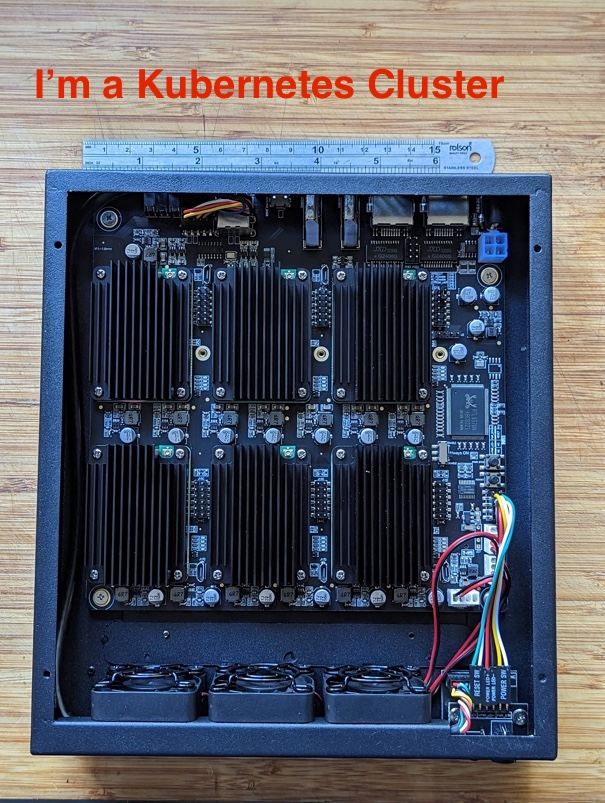

# Raspberry PI cluster running K3S managed by FluxCD

This repository contains configuration used by FluxCD V2 to manage K3S cluster, which  consists of 6 [Raspberry Pi Compute Module 4](https://www.raspberrypi.com/products/compute-module-4/?variant=raspberry-pi-cm4001000) with 8GB RAM installed on a [Deskpi Super6C board](https://deskpi.com/collections/deskpi-super6c/products/deskpi-super6c-raspberry-pi-cm4-cluster-mini-itx-board-6-rpi-cm4-supported) with [matching case](https://deskpi.com/collections/deskpi-super6c/products/deskpi-itx-case-kit-for-deskpi-super6c-raspberry-pi-cm4-cluster-mini-itx-board). Each board has a NVMe SSD attached.



| IP address | hostname | role |
|---|---|---|
| 192.168.1.204 | pie4 | master, longhorn storage node, servicelb node |
| 192.168.1.205 | pie5 | worker node, longhorn storage node |
| 192.168.1.206 | pie6 | worker node, longhorn storage node |
| 192.168.1.207 | pie7 | worker node, longhorn storage node |
| 192.168.1.208 | pie8 | worker node, longhorn storage node |
| 192.168.1.209 | pie9 | worker node, longhorn storage node |

I used [my fork of k3s-ansible](https://github.com/sloppycoder/k3s-ansible) repository to perform initial cluster install and initializations.

## Bootstrap FluxCD

First perform the steps in [prep](prep), basically create a few secrets in GCP Secret Manager which will be used later in the setup process. I use external secret to avoid the hassle of setup SOPS and managing keys locally. With the added benefit that setting up a new cluster is really easy, the secrets can be synced from the cloud the same way.

Download Flux CLI, follow the [officail documentation](https://fluxcd.io/flux/cmd/), then

```shell
export GITHUB_TOKEN=ghp_pat
flux bootstrap github   \
     --components-extra=image-reflector-controller,image-automation-controller \
     --owner=sloppycoder \
     --repository=k3s-fluxcd-vinolab \
     --branch=main \
     --read-write-key \
     --path=clusters/super6
```

## Access Dashboards

| URL  | Usage   |
|------|---------|
| <http://192.168.1.204/>  | Weave Gitops dashboard   |
| <http://192.168.1.204/dashboard>  | Traefik dashboard   |
| <http://192.168.1.204/longhorn>  | Longhorn dashboard (if installed)  |
| <http://192.168.1.204/whoami>  | test pod |

## Content

| Diretory  | Content  |
|-------|---------|
| [prep](prep) | steps to be peform manually prior to bootstrap FluxCD |
| [infra/controllers](infra/controllers) | infra components that creates CRDs that other configurations depend on. ```base``` directory contains the common components, ```optional``` directory contains the optional components, ```clusters``` directory contains the overlay for each cluster under management. |
| [infra/configs](infra/configs) | infra components configurations that uses, including those that depends on CRD in the ```controllers``` direcrory. The directory structure is similiar to ```controllers``` directory. ```namespaces``` diretory cotnains individual namespaces that will be created and their associated configuration, including networkpolicy. Each namespace can include components from [optional](infra/optional) directory.  |
| [clusters/](clusters/)| bootstrap and cluster specific configurations. the apps.yaml in each cluster defines the applications that will be deployed. The manifests for each application is expected to contain in a separate Git repository, see [vinobank-gitops](https://github.com/vino9org/vinobank-gitops) for an example. |  |

## Components

The following components are managed by FluxCD:

* [external-secrets](https://external-secrets.io/v0.8.3/) for syncing secrets from external source (e.g. GCP) to the cluster
* [Longhorn](https://longhorn.io) for persistent storage
* [nfs-subdir-external-provisioner](https://github.com/kubernetes-sigs/nfs-subdir-external-provisioner) for using NFS based persistent volumes.
* [cert-manager](https://cert-manager.io/) setup to works with [Let's Encrpt](https://letsencrypt.org/)
* [nats streaming](https://nats.io/) light-weigh high performance streaming
* [Spotahome Redis Operator](https://github.com/spotahome/redis-operator) for HA Redis setup
* [Kubegres PostgreSQL operator](https://www.kubegres.io/) for setting up HA PostgreSQL database instances
* [New Relic](https://newrelic.com) for infra monitoring

## Notes

This setup can be used in any K3S setup and should be easily adaptable to other K8S environment, e.g. AWS EKS or GKE.
